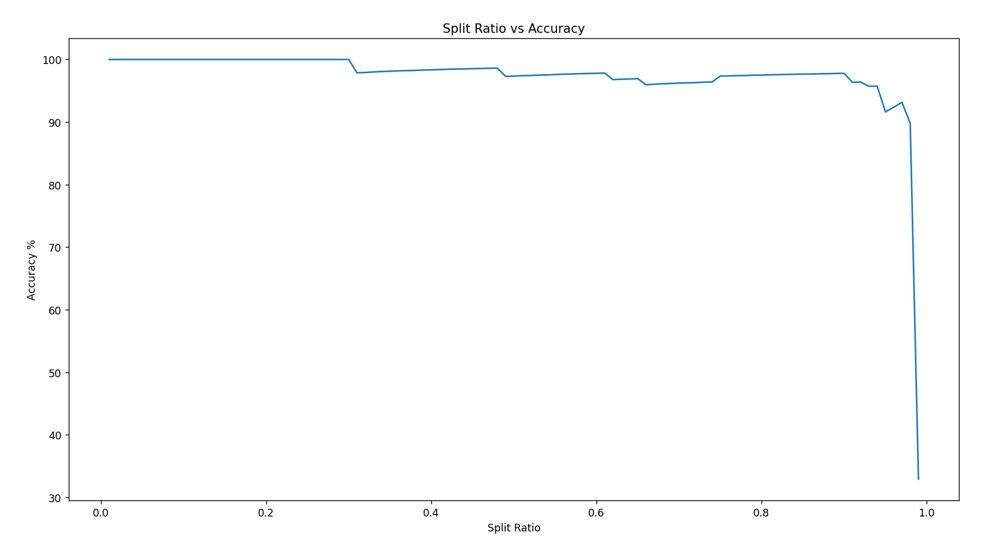

# Iris KNN Classifier

This project applies the **K-Nearest Neighbors (KNN)** algorithm on the classic Iris dataset using `scikit-learn`.

## Features

- Tests model accuracy across different values of:
  - **k** (number of neighbors)
  - **Test split ratio** (portion of data used for testing)
- Visualizes:
  - Accuracy vs **k**
  - Accuracy vs **Test split**
- Automatically selects the best value of **k**
- Predicts the species of a custom flower sample

## Results

### Accuracy vs Number of Neighbors (k)


### Accuracy vs Test Split Ratio


> Note: Both curves show similar trends due to their effect on training capacity.

## Run it

```bash
pip install -r requirements.txt
