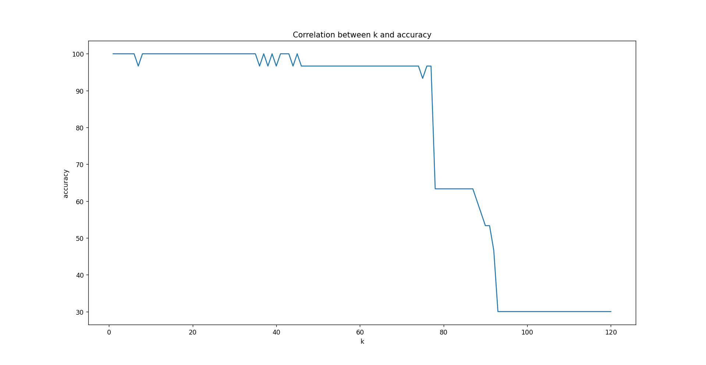

# Iris KNN Classifier

This project applies the K-Nearest Neighbors (KNN) algorithm on the classic Iris dataset using `scikit-learn`.

## Features

- Tests accuracy for k from 1 to 120
- Visualizes the effect of k on model performance
- Selects the best k
- Predicts the species of a custom flower sample

## Results



## Run it

```bash
pip install -r requirements.txt
python knn_iris_plot.py
